# Solution 1: Public transport routes and wait times app
## Problem
Public transport (Transmilenio and SITP buses) users don't really know how long will they have to wait for their route, as the buses very often don't arrive in regular intervals. This affects their estimations of the time they will take to get to their destinations.
## Solution
A mobile app in which users select beforehand the route that they are going to take and go to their stop. The app starts timing their wait time using the device GPS, when the user leaves in their bus the data is sent to the server. This data from all users is gathered and analyzed so that the wait times can be predicted based on historic data. On the other hand, the users can select their origin and destination and the app will select the best transport option for them based on trip and wait times.
## Personas
### Persona 1 
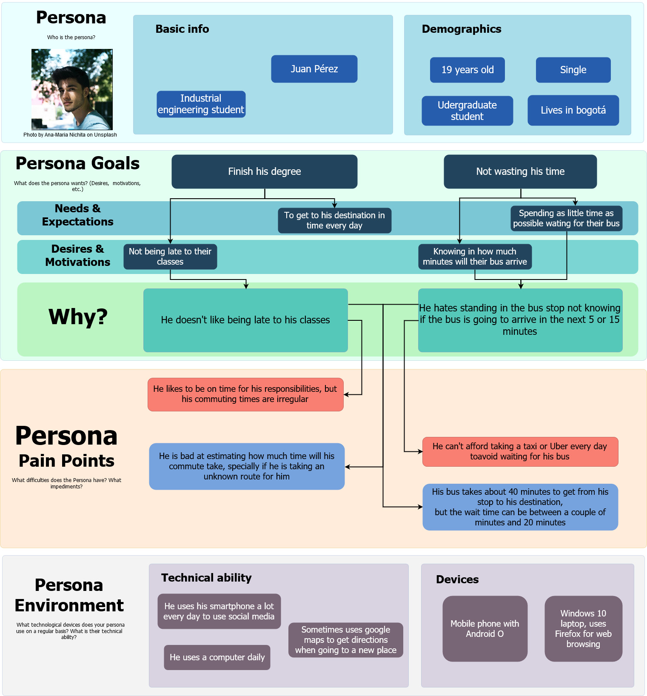
### Persona 2 
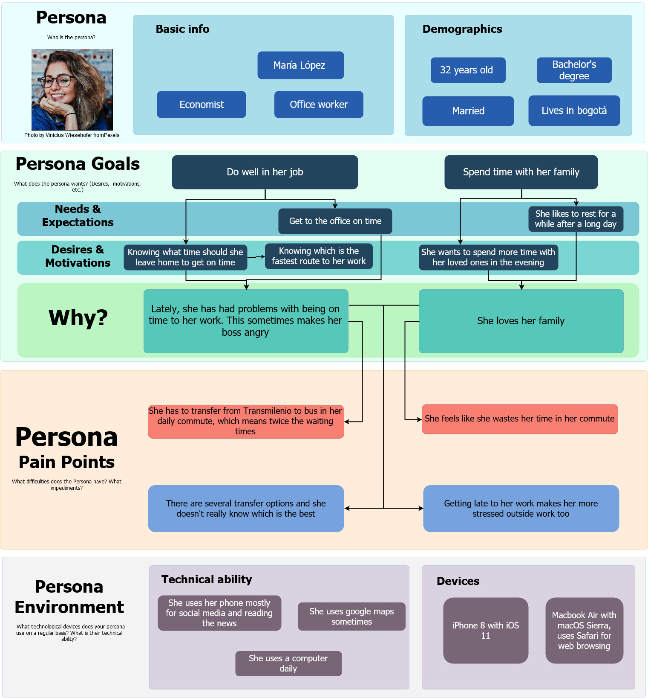
### Persona 3 
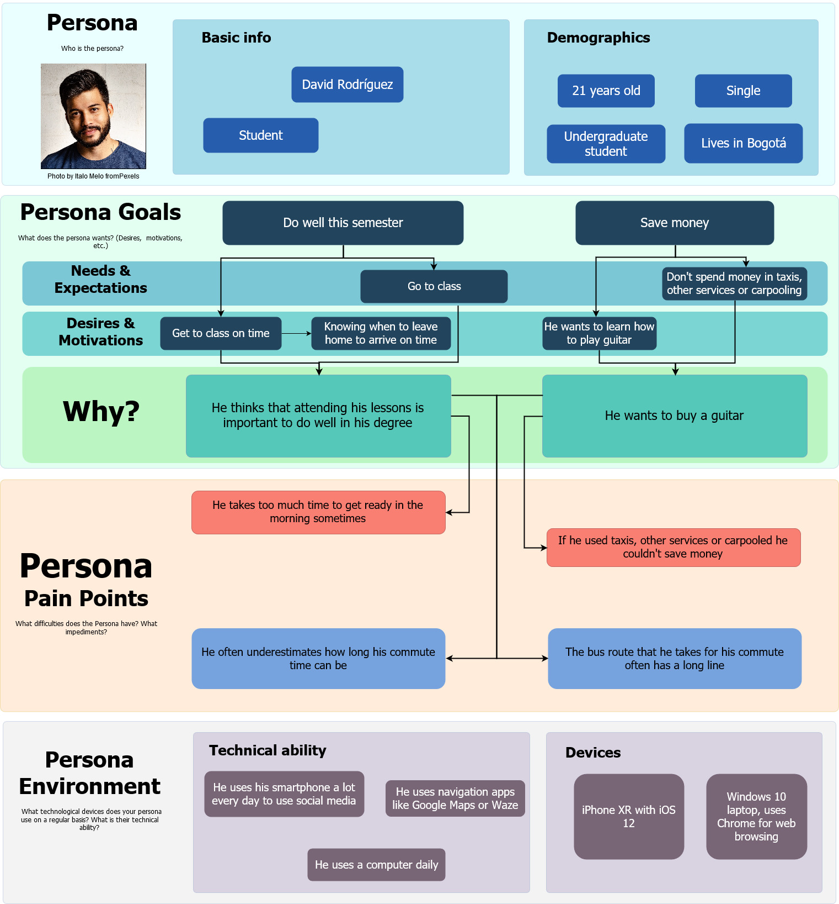
### Persona 4 
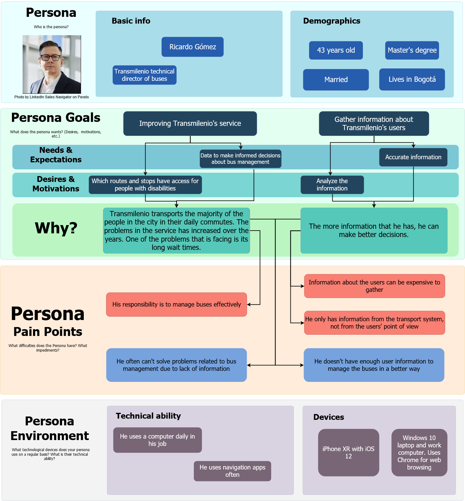
## Context canvas
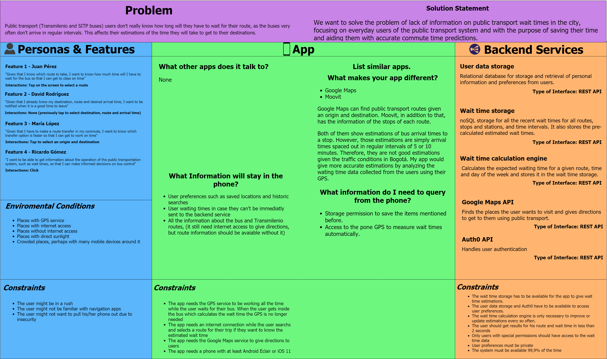
## Business Questions
1. What’s the traveling time of a specific route at a specific time?
2. What’s the waiting time of a specific station at a specific time?
3. How crowded is a specific station at a specific time?
4. What’s the best time to wait for a specific bus?
5. How many people are traveling a route at a specific time?
6. How does waiting time change during the day on a specific station?
7. How does traveling time change during the day for a specific route?
8. How does the amount of people vary during the day for a specific station?
9. What weekday has the most amount of users?
10. What weekday has the highest average waiting time?
11. What weekday has the highest average travelling time?
12. How many buses are in transit at a specific time?
13. How many buses are in transit for a specific route?
14. How many stops does a bus have?
15. Which buses have the most stops?
16. How many stops does a route have?
17. Which routes have the most stops?
18. Which are the longest routes?
19. How many buses travel across different areas?
20. What is the area where most people are moving at a certain hour?
21. From which areas do most trips originate?
22. To which areas are most trips heading?
23. At what time are buses moving slowest?
24. How long are buses taking on average at each stop?
25. Which are the routes with the most transfers?
26. At what hours do people tend to start using public transport?
27. Which stations have the least recollected data from users?
28. Which trips have the least recollected data from users?
29. What months have the most traffic?
30. How much time is spent inside public transportation each day?
31. How many users does the app have?
32. Which routes don’t have a viably efficient alternate route?
33. How will the app affect the routes taken by the users?
34. Which buses have the least amount of users?
35. Which routes have the least amount of users?
36. How far apart is a specific station from another one?
37. How many users stop their trip midway?
38. How many users cancel their planned trips?
39. How much time in advance do people plan their trips?
40. How does the expected time of a planned trip change with new information?
## VD map
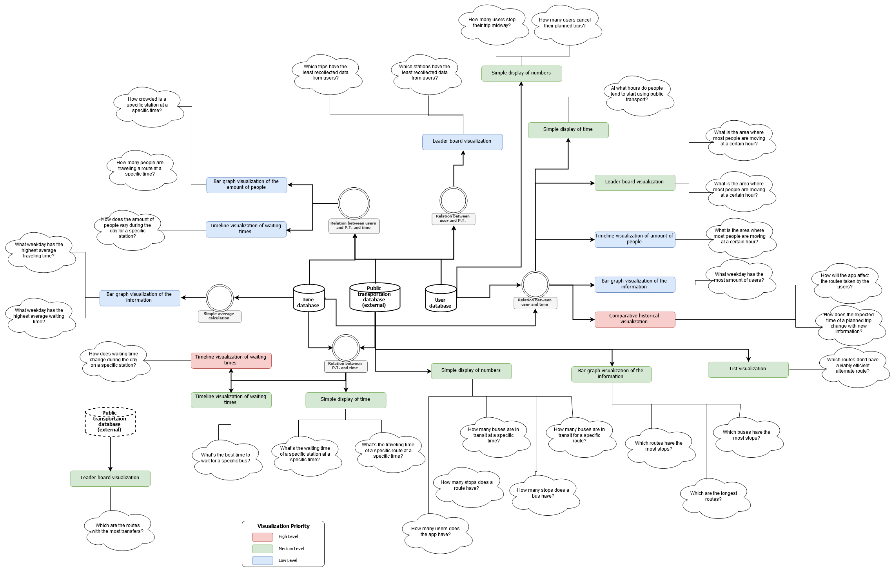
## Functional scenarios 
1. Me, Juan, given that I know which route to take and have internet access, I want to know how much time it will take me to get to class, taking into account the time that I will have to wait for the bus so I can get in time.
2. Me, David, given that I know which route to take, have traveled in it previously at this time and don't have internet access, I want to know how much time it will take me to get to class, taking into account the time that I will have to wait for the bus so I can get in time.
3. Me, María, given that I don't know which route to take and have internet access, I want to know how much time it will take to get to my work, taking into account the time that I will have to wait for the bus so I can get in time. 
4. Me, María, given that I know my destination, route and desired arrival time and have internet access at the moment of making the request, I want to be notified when it is a good time to leave to be on time.
5. Me, David, given that I know my destination, route, and desired arrival time and have traveled in that route at this time of the day, I want to be notified when it is a good time to leave to be on time even if I don't have internet access.
6. Me, María, given that I have several route options to get to work, the time that I want to arrive and that I have internet access, I want to know which of them is fastest. 
7. Me, Ricardo, given that I am a Transmilenio executive, I want to know which are the routes that have longer waiting times on average so that I can make decisions based on that information. 
8. Me, Ricardo, given that I am a Transmilenio executive, I want to know which stations have the longer waiting times and at what time of the day so that I can make decisions based on that information.
9. Me, Ricardo, given that I am a Transmilenio executive, I want to know which stations are more crowded at a certain time and day so that I can make decisions based on that information.
10. Me, Juan, given that I have to make a route transfer in my commute and that I have internet access, I want to know which transfer is the best, so that I can get home faster. 
11. Me, David, given that I know my destination, route and desired arrival time, and I have internet access, I want to be notified if I will not arrive on time at my destination via public transportation. 
12. Me, María, Given that I'm already on my way to work and have internet access, and there has been an incident preventing me from taking my usual route I want to know the best possible alternate route and the time it will take to travel it.
13. Me, Juan, Given that I have internet access, I want to be able to plan a trip with multiple stops, get the fastest possible route and be informed the time it will take to complete.
14. Me, David, Given that I have internet access, I don't know my route but I do know my destination, and public transportation is closing soon, I want to be notified when I have to leave so that I reach my destination before it closes.
15. Me, María, Given that I don't know the route I'm about to take, I want detailed information about travelling the route so that I don't get lost.

## Quality scenarios
| Item | Description |
| ------ | ------ |
| Scenario number | 1 |
| Scenario name | Lack of internet connection when searching an unknown route |
| Quality Attributes | Eventual connectivity, resilience | 
| App status and context | The app is trying to connect to the internet to find the route. | 
| Changes in the context | The user loses connection when he arrives to the station. | 
| System reaction | The app notifies the user of the lack of internet connection, the task will be started if the connection restablishes |

| Item | Description |
| ------ | ------ |
| Scenario number | 2 |
| Scenario name | Lack of internet connection when searching wait times for a known route |
| Quality Attributes | Eventual connectivity, resilience | 
| App status and context | The app is finding the wait times for a route that the user has used before | 
| Changes in the context | The user loses internet connection | 
| System reaction | The app notifies the user of the lack of internet connection and shows him only the wait times that are stored locally if there are any for the time of the day, or else it shows  | 

| Item | Description |
| ------ | ------ |
| Scenario number | 3 |
| Scenario name | Location fails while a wait time is being mesured |
| Quality Attributes | Resilience | 
| App status and context | The app is measuring a wait time while the phone is in the user's pocket | 
| Changes in the context | The GPS service fails for an unknown reason | 
| System reaction | The app stops the timer and discards the wait time. When the user opens the app again (or immediately, depending on the configuration), they will be told that the measuring failed due to an error in the location |

| Item | Description |
| ------ | ------ |
| Scenario number | 4 |
| Scenario name | Backend availability |
| Quality Attributes | Availability | 
| App status and context | The backend is operating normally | 
| Changes in the context | The backend service crashes | 
| System reaction | The backend service is running on a load balancing cluster, so the service stays available even if one of the replicas fails. The user that made the request that crashed the service gets an error message and has to repeat it |
 
| Item | Description |
| ------ | ------ |
| Scenario number | 5 |
| Scenario name | Unauthorized users |
| Quality Attributes | Security | 
| App status and context | The backend is operating normally | 
| Changes in the context | An unauthorized user tries to access any backend service that is not intended from final users and that has user data (e.g. user profiles or wait times from different users) | 
| System reaction | The system doesn't allow it because the user doesn't have a valid API key and sends him a 401 error |

| Item | Description |
| ------ | ------ |
| Scenario number | 6 |
| Scenario name | Malicious users |
| Quality Attributes | Security | 
| App status and context | The backend is operating normally | 
| Changes in the context | Someone with a valid API key tries to access the user profile of someone else| 
| System reaction | The system doesn't allow it because the user isn't authenticated as the user profile that he wants to visit |

| Item | Description |
| ------ | ------ |
| Scenario number | 7 |
| Scenario name | Password security |
| Quality Attributes | Security | 
| App status and context | The user opens the app | 
| Changes in the context | The user logs in with his username and password | 
| System reaction | The user can log in if the password is correct. The passwords are cyphered in the transmission and are compared against a hash in the database. Passwords are never stored | 

| Item | Description |
| ------ | ------ |
| Scenario number | 8 |
| Scenario name | General request performance |
| Quality Attributes | Performance | 
| App status and context | The backend is operating normally | 
| Changes in the context | A user makes any request to the backend | 
| System reaction | The app responds to the request properly and in less than 2s |  

| Item | Description |
| ------ | ------ |
| Scenario number | 9 |
| Scenario name | Scalability and availability in rush hour |
| Quality Attributes | Scalabilty, availability | 
| App status and context | The server is working in normal conditions | 
| Changes in the context | Rush hour starts, so the number of requests increases |
| System reaction | The system should work under high loads of requests, the backend application should be executed using a load balancer tactic |

| Item | Description |
| ------ | ------ |
| Scenario number | 10 |
| Scenario name | Performance in rush hour |
| Quality Attributes | Performance, scalability | 
| App status and context | The server is working in normal conditions | 
| Changes in the context | Rush hour starts, so the number of requests increases  | 
| System reaction | The system should not decrease its performance in rush hour, the backend application is being executed using a load balancer tactic. If the performance decreases, more hardware resources should be put in the system | 

| Item | Description |
| ------ | ------ |
| Scenario number | 11 |
| Scenario name | The user should be find what he is looking for in a few taps |
| Quality Attributes | Usability | 
| App status and context | The user opens the app | 
| Changes in the context | The user wants to look for a wait time or route | 
| System reaction | The user should be abe to find what he is looking for in less than 4 taps, one text entry if necessary and one scroll down if necessary | 

| Item | Description |
| ------ | ------ |
| Scenario number | 12 |
| Scenario name | The app should be easy to understand |
| Quality Attributes | Usability | 
| App status and context | The user opens the app | 
| Changes in the context | The user is trying to do any action | 
| System reaction | Without effort, the user should be able to understand how to do what he wants to | 
 
| Item | Description |
| ------ | ------ |
| Scenario number | 13 |
| Scenario name | The app works properly in the background |
| Quality Attributes | Efficience, resilience | 
| App status and context | The user is using the app | 
| Changes in the context | The user starts to use another app and this one goes to the background | 
| System reaction | The app doesn't close, so if the user was in the middle of a search he can continue from where he left it when he comes back. Also, if there was a timer running it continues running and stops running automatically according to the location even if the app is in the 

| Item | Description |
| ------ | ------ |
| Scenario number | 14 |
| Scenario name | Battery consumption |
| Quality Attributes | Efficience | 
| App status and context | The app is measuring a wait time | 
| Changes in the context | Several minutes pass | 
| System reaction | The location should be detected in long enough time intervals that the battery is not drained and the mearurements are still precise | 

| Item | Description |
| ------ | ------ |
| Scenario number | 15 |
| Scenario name | Wait time accuracy |
| Quality Attributes | Accuracy | 
| App status and context | The app is working with internet connection | 
| Changes in the context | The user looks for a wait time of a particular route | 
| System reaction | The app gives the user a wait time estimation that is never less than the real one and is as close to reality as possible the great majority of the times if there aren't any special traffic events | 
 
# Solution 2 : Massive transportation app
## Problem
Crowds, times and safety are among the biggest causes of discomfort in the public transportation. People are not confortable taking their daily buses and would rather prefer other cheap option. 
## Solution
We are the mobile app development team 6, and we are developing a way to solve the problem, focusing on people that use public transportation in a daily basis by providing on-demand planned transportation with the purpose of improving comfort in transportation and help reduce air pollution by promoting shared transportation.
### Persona 1 
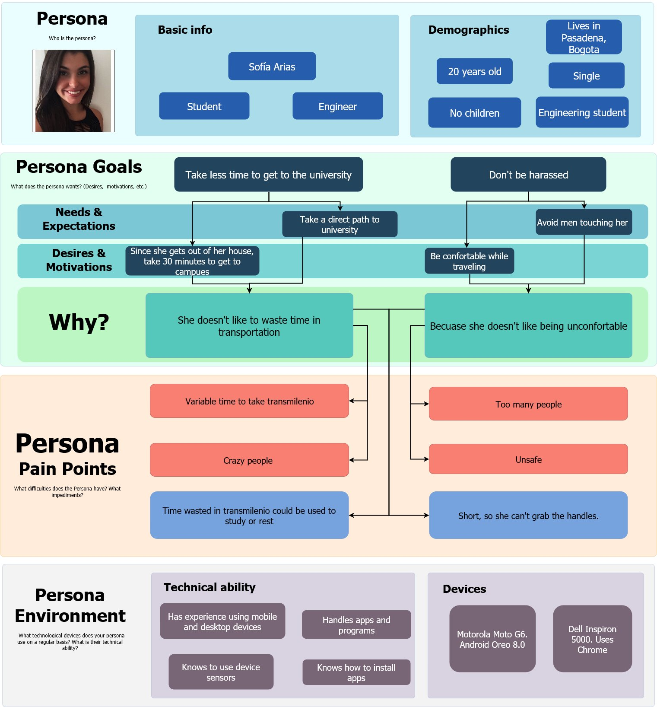
### Persona 2 
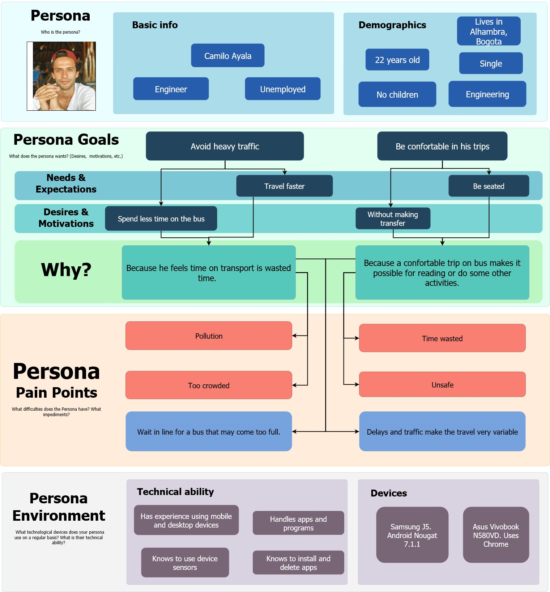
### Persona 3 
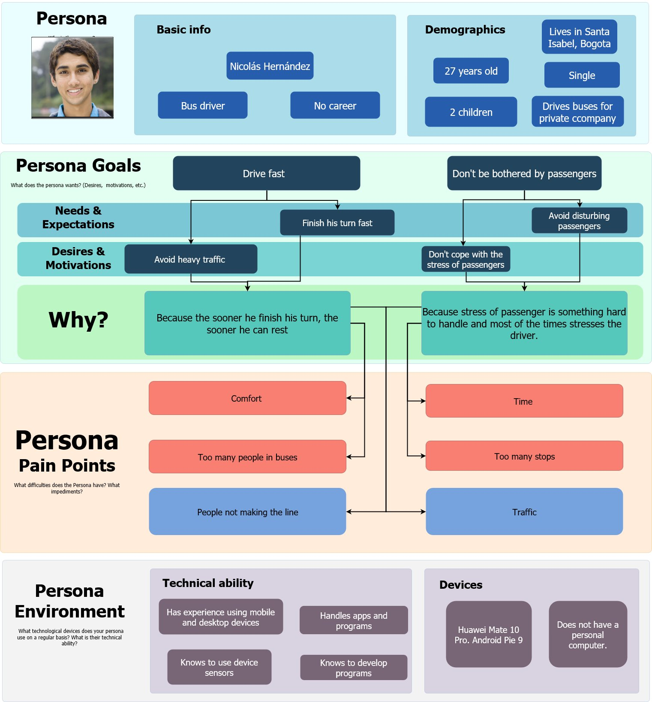
### Persona 4 
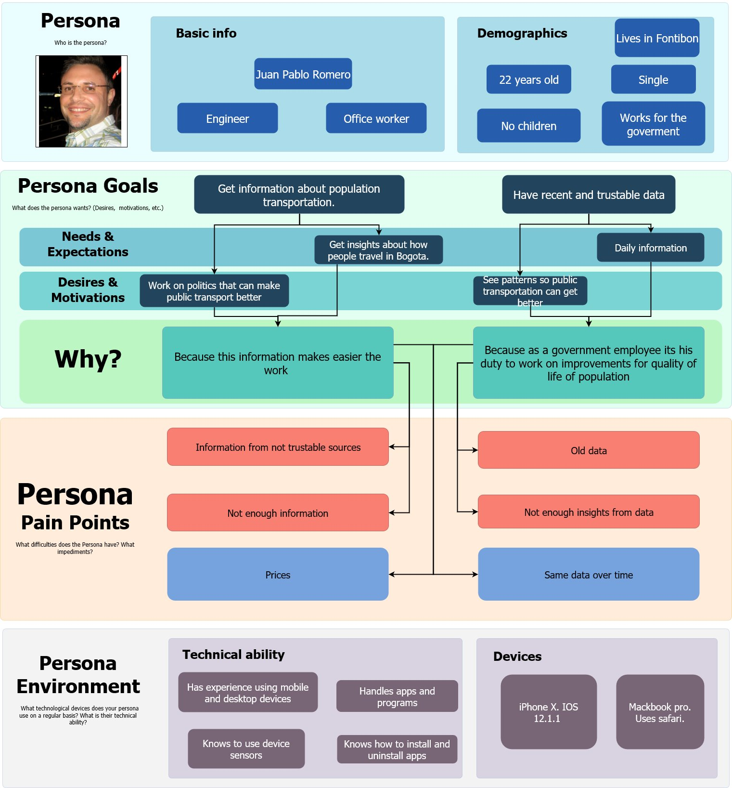
## Context canvas
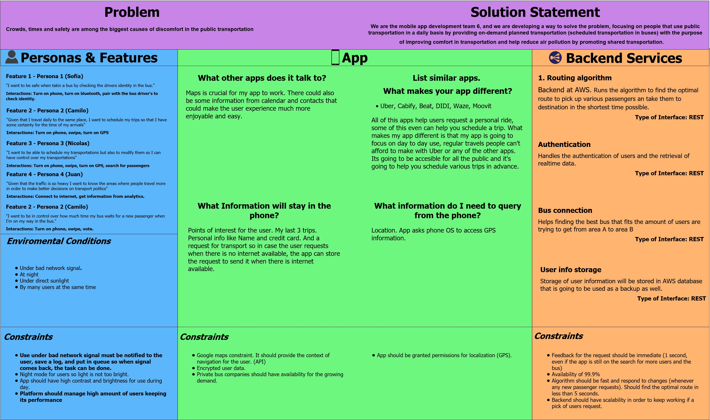
## Business Questions
1. Which is the most traveled route?
2. How long does it take a bus to finish a route?
3. How much is a user willing to pay for the service?
4- Where are the best spots to pick up and let off passengers?
5. What type of people use the app?
6. How much are people saving by using the app?
7. Which is the least traveled route?
8. When is a new service required in a specific sector?
9. What areas are critical (areas that cause more traffic)?
10. What is the earliest and latest times passengers request transportation?
11. What buses will be driven?
12. Which sector or neighborhood has the highest amount of clients?
13. Which rout has the highest amount of accidents?
14. Which route has the highest amount of gas consumption?
15. Which driver has the best rating?
16. Which driver has the worst rating?
17. How many disabled people use the app?
18. At what time during the day are most of the requests for the service made?
19. How fast in average a transportation service is confirmed?
20. How many cancellations are made?
21. How long in advance is a cancellation made on average?
22. How long does a passenger last in the bus in average?
23. In what weather conditions are the most requests made?
24. At what time of the day are the most requests made?
25. What's the average age of users?
26. What's the distribution of gender between users?
27. How is the user population distributed throughout a specific sector?
28. Which are the most frequent destinations for a group of users?
29. How can alternate routes be made in case of a mishap?
30. How many people are moving at a certain time?
31. How many people request a bus with a specific anticipation time (e.g. how many people request service 3 days in advance)
32. On average how many days in advance do people request a service?
33. How many buses are moving at a certain time? 
34. How much distance do buses transit on average each day?
35. How many stops do a bus make on average per trip?
36. How long does a bus driver work before having to stop?
37. What is the longest trip a user makes?
38. How long does a passenger have to wait until a bus is confirmed?  
39. How many times does a bus have to change its planned route?
40. How many buses are involved in accidents?
41. How many users does the app have?
## VD map
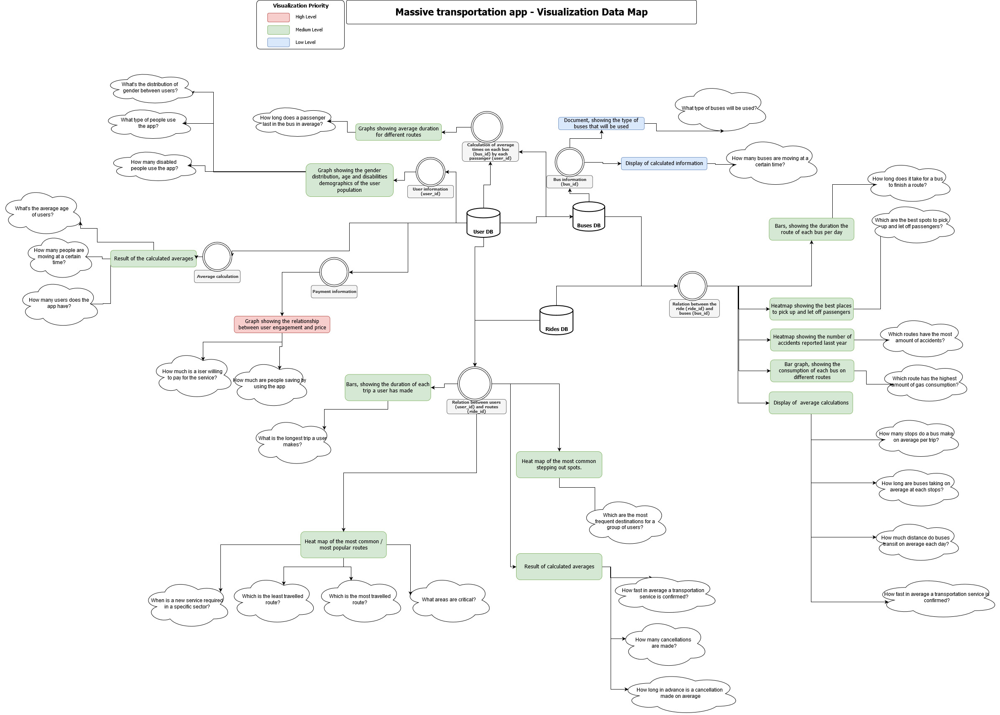
## Functional scenarios 
1. Me, Sofia, as a passenger, given that I take a route to my university daily and I have internet access at some point days before my trip, I want to schedule my trip so I know the time a bus will pick me up.
2. Me, as Nicolas, as a bus driver, I want to offer capacity in my bus to potential passengers so I optimize the number of trips I make with my bus and I make more money.
3. Me, Juan Pablo, as a Bus company planning worker, I want to manage my buses idle time so I can earn more money the times the bus is not in use. 
4. Me, Camilo as a passenger, I want to know if the people I am going to take the bus with don't have bad intentions and I can feel safe in my trip. 
5. Me, Nicolas, as a bus driver, I want to make less stops so I can avoid traffic.
6. Me, Camilo as a passenger, I want to know the localization of my bus before arriving so I know where exactly to go out and wait for the bus.
7. Me, Sofia, as a passenger, I want to be seated while I move to my destination so I am comfortable and safe.
8. Me, Sofia, as a passenger, I want to share my trip so I know I am contributing to less pollution. 
9.  Me, Juan Pablo, as a Bus company planning worker, I want bad passengers to be identified so I don't let them in my buses and I can take more care of my buses.
10. Me, Nicolas, as bus driver I want to know the exact positions of my stops in advance so I can drive better. 
11. Me, Camilo, as a passenger I want to rate my bus driver based on his way of driving so I know which drivers are better.
12. Me, Camilo as a passenger, I don't want my trip to be delayed because of another passenger so I get on time to my destination
13. Me, Juan Pablo, as a bus company CEO I want to know keep track of the locations of my buses so I know if a bus driver is trying to do something else with my buses. 
14. Me, Camilo as a passenger I want to be picked up near my home so I am more comfortable waiting for my transportation.
15. Me, Nicolas, as a bus driver I want to know in advance for cancellations so I can re-schedule my trips. 
## Quality scenarios
| Item | Description |
| ------ | ------ |
| Scenario name | Lack of notifications when waiting for a bus to arrive |
| Quality Attributes | Connectivity | 
| App status and context | The app is trying to notify the user of when his/her bus will arrive. | 
| Changes in the context | The user looses connection to the internet. | 
| System reaction | The app notifies the user that there is no connection and that an update will be given when connection is restablished | 

| Item | Description |
| ------ | ------ |
| Scenario name | Lack of connectivity when tring to make a reservation for a bus ride. |
| Quality Attributes | connectivity, resilence | 
| App status and context | The user is trying to make a reservation through the app | 
| Changes in the context | The device looses connection in the middle of the process of finding a bus and time | 
| System reaction | The app notifies the user that there is no connection and that the process will continue when connection is restablished | 

| Item | Description |
| ------ | ------ |
| Scenario name | Sniffing attempts on the information transmitted |
| Quality Attributes | security | 
| App status and context | The app is transmitting information to and from the server and someone is trying to collect that information | 
| Changes in the context | The user is inserting it's username and password | 
| System reaction | Packets sent from the device and from the server should be encrypted | 

| Item | Description |
| ------ | ------ |
| Scenario name | Many many requests to the server |
| Quality Attributes | Performance, scalability | 
| App status and context | The server is receiving more requests than usual | 
| Changes in the context | It is rush hour/special day and many people are asking and/or looking for transport | 
| System reaction | The system manages petitions through a balancer that distributes them among 2 or more servers. So the platform is able to scale up and process the requests | 

| Item | Description |
| ------ | ------ |
| Scenario name | System down |
| Quality Attributes | Resilence, availability | 
| App status and context | System is down and not able to show the available buses | 
| Changes in the context | There is a maintenance schedule on the servers | 
| System reaction | The system shoudl recover ASAP. Holding an overall availability of 99.9% | 

| Item | Description |
| ------ | ------ |
| Scenario name | Locating users position |
| Quality Attributes | Performance, accuracy | 
| App status and context | App is trying to zone in on the location of a passenger | 
| Changes in the context | The user is requesting a service close to him | 
| System reaction | The app uses GPS to locate the user and locate a bus service near him |

| Item | Description |
| ------ | ------ |
| Scenario name | New user tries the app for the first time |
| Quality Attributes | Simplicity, accesibility | 
| App status and context | The mobile app is being used and explored by a new user | 
| Changes in the context | The user downloads the app for the first time, register and reserves a bus | 
| System reaction | The app is simple enough for a new user to understand and it is accesible enough for everyone (all people) to use | 

| Item | Description |
| ------ | ------ |
| Scenario name | Lack of internet connection during cancellation |
| Quality Attributes | Eventual connectivity, resilience | 
| App status and context | The mobile app is uploading data to the remote server. The user is trying to cancel a planned ride.  | 
| Changes in the context | The user gets into a lie-fi zone (i.e., connection is poor) and eventually the data connection is lost. | 
| System reaction | The app notifies the user about the poor connection and the "upload" task is moved to a local queue for being resumed later. Log of tasks that has the timestamp of the time the user made the cancellation. | 

| Item | Description |
| ------ | ------ |
| Scenario name | Battery saver mode |
| Quality Attributes | Performance, resilience | 
| App status and context | The mobile app is showing the map so the user can request a planned ride. Battery saver mode kicks in. | 
| Changes in the context | The processor speed is reduced and memory available is shortened. | 
| System reaction | The app should use the available resources to show the map in a simplified way (e.g. showing less area).  | 

| Item | Description |
| ------ | ------ |
| Scenario name | Encrypted storage |
| Quality Attributes | Security | 
| App status and context | User information stored in the database | 
| Changes in the context | At any moment in time. | 
| System reaction | The system should not store the information in plain text. It should be encrypted. | 

| Item | Description |
| ------ | ------ |
| Scenario name | Long term app growth  |
| Quality Attributes | Scalability | 
| App status and context | X number using the app, but with time more users join the app. | 
| Changes in the context | More petitions managed and more information stored. | 
| System reaction | Horizontal and vertical scalability for new users. More severs able to join the servers responding to the balancer. | 

| Item | Description |
| ------ | ------ |
| Scenario name | Performance |
| Quality Attributes | Resilience | 
| App status and context | X number of users have requested transportation. | 
| Changes in the context | New users in the same area as last users make new petitions for transportation. | 
| System reaction | A backend algorithm recalculates the optimal routing for picking and droping the users in the shortest time. | 

| Item | Description |
| ------ | ------ |
| Scenario name | Immediate response |
| Quality Attributes | Usability | 
| App status and context | An user has requested a transportation. | 
| Changes in the context | Petition was sent. | 
| System reaction | App should show an accepted petition screen, even though the bus not necessarily was assigned. | 

| Item | Description |
| ------ | ------ |
| Scenario name | Battery consumption |
| Quality Attributes | Performance | 
| App status and context | App is showing the map. Using user's location | 
| Changes in the context | At any moment in time. | 
| System reaction | App should not use much battery and perform in a optimal form | 

| Item | Description |
| ------ | ------ |
| Scenario name | Responsiveness |
| Quality Attributes | Accessibility | 
| App status and context | User using the app in his phone vertically | 
| Changes in the context | User changes the position of his phone to horizontal form. | 
| System reaction | App should be responsive  | 